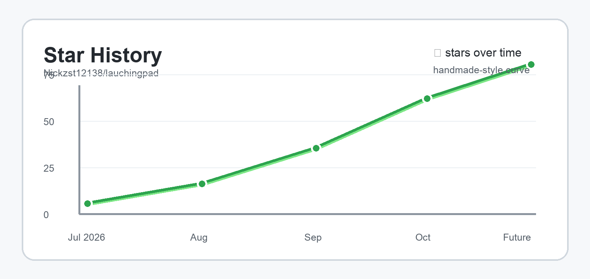

# lauchingpad

<p align="right">
  <a href="README.md"></a>
</p>

A lightweight Launchpad-style app launcher for macOS 27 beta.

`lauchingpad` brings back a familiar app grid when the new macOS Apps launcher feels unstable, hard to trigger, or simply not close enough to the classic Launchpad flow. Click it from the Dock, search by typing, move with arrow keys, press Enter, and get out of the way.

[](https://github.com/Nickzst12138/lauchingpad/stargazers)

## Why

macOS 27 beta changes the old Launchpad experience. Some users also report that the system Apps launcher / Launchpad entry does not open reliably on beta builds.

`lauchingpad` does not patch or depend on Apple's launcher. It ships as a small independent app launcher:

- Scans installed apps from `/Applications`, user Applications, and system Applications.
- Shows a clean application grid with icons and names.
- Opens from the Dock and hides on the next Dock click.
- Supports instant keyboard search.
- Supports arrow-key selection and Enter-to-open.
- Hides with Esc.
- Hides automatically after launching an app.
- Keeps the real launcher window out of Cmd-Tab.
- Starts quietly at login so it is ready without popping up.

## Download

The install image is included in this repository:

```text
lauchingpad-installer.dmg
```

Open the DMG, then run:

```text
Install lauchingpad.pkg
```

The installer places:

```text
/Applications/lauchingpad.app
/Applications/lauchingpad-agent.app
/Library/LaunchAgents/com.nick.lauchingpad.launchagent.plist
```

It also pins `lauchingpad.app` to the Dock.

macOS may ask for an administrator password and may show a background item / login item prompt. That is expected because the installer writes into `/Applications`, installs a LaunchAgent, and updates Dock items.

## How It Works

Version 2.2 uses a two-app design:

```text
lauchingpad.app          Dock entry and click toggle
lauchingpad-agent.app    Background window service
```

`lauchingpad.app` is the visible Dock app. It receives your click, sends an open/hide request to the agent, then exits.

`lauchingpad-agent.app` owns the real launcher window. It runs as an `LSUIElement`, so it does not show an extra Dock icon and does not appear as a normal Cmd-Tab app. Login starts the agent with `--start-hidden`, which keeps it warm without showing the launcher.

The agent also checks for duplicate instances. This prevents login startup and Dock clicks from creating multiple background services.

## Usage

| Action | Result |
| --- | --- |
| Click Dock icon | Open launcher |
| Click Dock icon again | Hide launcher |
| Type | Search apps immediately |
| Arrow keys | Move selection |
| Enter | Open selected app |
| Esc | Hide launcher |

## Source Layout

```text
source/ZZLaunchpad/
├── Sources/
│   ├── main.swift          # background launcher window service
│   ├── launcher.swift      # Dock entry / toggle command app
│   └── make_icon.swift     # icon generation helper
├── Info.plist              # Dock app plist
├── Agent-Info.plist        # background agent plist
└── build/icon.iconset/     # app icon assets
```

## Build Notes

The current package was built for Apple Silicon and targets macOS 26.0 as the minimum runtime version, so it can run on the current macOS 27 beta without being marked as a too-new binary by LaunchServices.

The release bundle contains:

```text
lauchingpad-installer.dmg
source/ZZLaunchpad/
README.md
README.md
LICENSE
```

## Changelog

### 2.2

- Split into `lauchingpad.app` and `lauchingpad-agent.app`.
- Kept the Dock icon stable while keeping the real window service out of Cmd-Tab.
- Added login startup through `lauchingpad-agent.app --start-hidden`.
- Added duplicate-agent detection so Dock clicks do not spawn extra services.
- Installed both apps through the package installer.
- Built with minimum macOS target `26.0` for current macOS 27 beta compatibility.

### 2.1

- Restored permanent Dock behavior after hiding the window.
- Avoided switching the visible Dock entry into a background-only app.

### 2.0

- Tested single-app background switching after hide.
- Replaced this approach because it removed the Dock entry.

### 1.9

- Added DMG installer packaging.
- Added login startup LaunchAgent.
- Added automatic Dock pinning.

### 1.8

- Added Dock click toggle behavior.
- Added Esc-to-hide.
- Added auto-hide after opening an app.
- Improved search field behavior.
- Fixed stale keyboard-selection highlight.
- Added system Apps / Launchpad icon styling.

## Uninstall

Remove these files:

```text
/Applications/lauchingpad.app
/Applications/lauchingpad-agent.app
/Library/LaunchAgents/com.nick.lauchingpad.launchagent.plist
```

Then remove `lauchingpad` from the Dock with:

```text
Right click Dock icon -> Options -> Remove from Dock
```

## License

MIT License. See [LICENSE](LICENSE).
